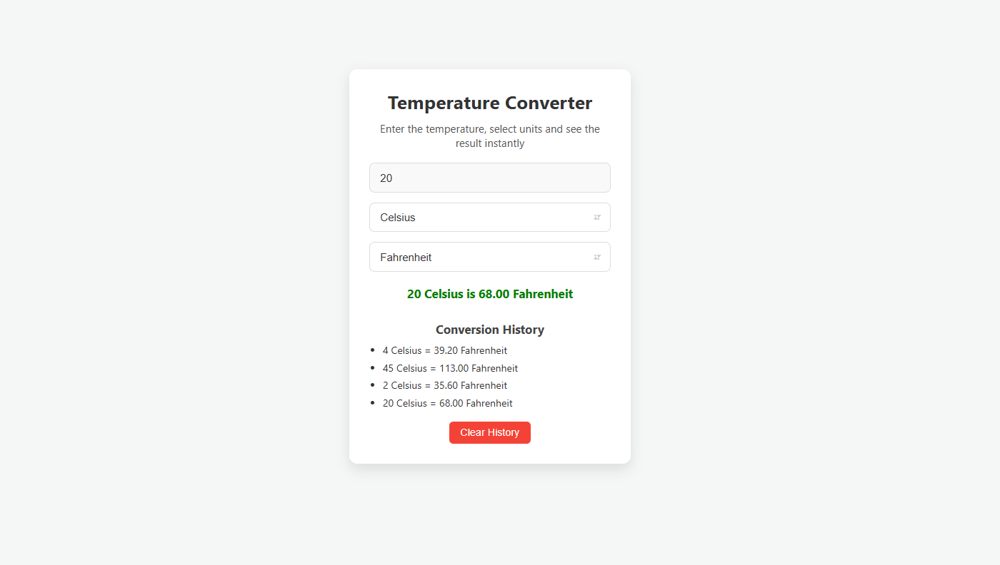

# 🌡️ Temperature Converter

A responsive and user-friendly temperature converter web app built using **HTML**, **CSS**, and **JavaScript**. It supports real-time conversion between Celsius, Fahrenheit, and Kelvin with conversion history.

---

## 🔥 Features

- 🔁 Convert between Celsius, Fahrenheit, and Kelvin
- ⚡ Real-time conversion as you type
- 📜 Conversion history tracking
- 🧹 Clear history functionality
- 🖥️ Fully responsive design

---

## 🖼️ Preview

---

## 🛠️ Built With

- HTML5
- CSS3
- JavaScript
- Responsive Web Design principles

